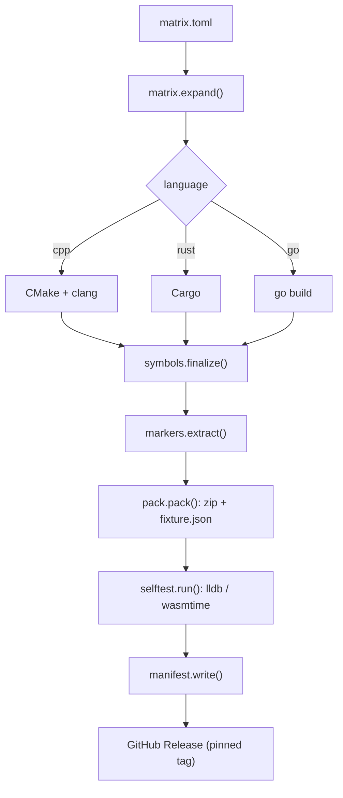

# Design

This project exists to produce, prove, and publish **known-debuggable native
processes** so a DAP bridge can be tested against a wide, realistic space of
debugging situations without compiling anything at test time.

## Principles

1. **One declarative source of truth.** [`matrix.toml`](../matrix.toml) lists
   the programs, languages, platforms, and symbol modes. Everything else is
   derived. The configuration set never lives in code.
2. **Idiomatic toolchains, one thin orchestrator.** Real projects build C++
   with CMake, Rust with Cargo, Go with `go build`. We do the same, so the
   artifacts look like real debuggees. A small Python layer (`builder/`) only
   orchestrates, splits symbols, packs, and tests.
3. **Names, not line numbers.** `// @dap:<marker>` comments are resolved to
   line numbers at build time and recorded in `fixture.json`. Tests reference
   breakpoints by name; editing a fixture can't silently break a line number.
4. **Honest capabilities.** The matrix only emits configurations that are
   physically meaningful (see below). Shipping an artifact that can't actually
   be debugged would be worse than omitting it.
5. **Prove before publish.** Nothing reaches a Release without a debugger
   actually setting a breakpoint (or hitting a fault) against it.

## Pipeline



## Dimensions today

| Dimension | Values |
|-----------|--------|
| OS / arch | linux-x86_64, macos-arm64, windows-x86_64, android-{arm64-v8a, armeabi-v7a, x86_64, x86}, wasm32-wasip1 |
| Language  | C++, Rust, Go |
| Symbols   | embedded, separate |

The cross product is pruned by `supported_symbol_modes(language,
object_format)` in [`builder/matrix.py`](../builder/matrix.py), which encodes
how each toolchain actually emits debug info:

| Object format | C++ | Rust | Go |
|---------------|-----|------|----|
| ELF (Linux, Android) | embedded, separate | embedded, separate | embedded, separate |
| Mach-O (macOS) | separate (.dSYM) | separate (.dSYM) | embedded (`__DWARF`) |
| PE (Windows) | embedded (DWARF), separate (PDB) | separate (PDB) | embedded (DWARF) |
| WASM | embedded | embedded | embedded |

Why the asymmetry is real, not arbitrary:

- **Mach-O + clang/rustc** keep DWARF in `.o` files (a "debug map"); the only
  relocatable, shippable form is a `.dSYM` bundle (`dsymutil`). So clang/Rust
  on macOS are separate-only.
- **Mach-O + Go** writes a `__DWARF` segment straight into the executable, so
  Go on macOS is embedded-only.
- **PE** PDBs are inherently a sidecar; clang can also emit in-binary DWARF.
- **WASM** has no sidecar convention; DWARF lives in the `.wasm`.

This currently expands to **120 configurations** (`python -m builder list`).

## Symbol splitting

`builder/symbols.py` finalizes the `separate` mode per object format:

- **ELF**: `llvm-objcopy --only-keep-debug` -> `<name>.debug`, then
  `--strip-debug` the binary, then `--add-gnu-debuglink` so the debugger finds
  it by basename + build-id.
- **Mach-O**: `dsymutil` -> `<name>.dSYM` bundle, then `strip -S` the binary.
- **PE**: collect the `.pdb` the compiler already emitted.

`embedded` is a copy; WASM is always embedded.

## Build-system rationale

CMake for C++ is a deliberate fidelity choice: the fixtures carry build-ids and
`-fdebug-prefix-map`'d source paths, so they reproduce the exact source-path
remapping a real debuggee forces a DAP bridge to handle
(`DapPathRemap`/`DapSourceMapper` on the consumer side). Cargo and `go build`
are the only sane choices for their languages. The Python orchestrator was
chosen over Gradle/Go because it is preinstalled on every runner, uses only the
stdlib (`tomllib`, `zipfile`, `hashlib`, `subprocess`), and keeps the whole
flow legible in one place.

## Consumption contract

The published Release (tag = `release_tag`) contains one zip per configuration
plus `manifest.json`:

```json
{
  "schema": 1,
  "release_tag": "v0.1.0",
  "configurations": [
    {
      "id": "spin-linux-x86_64-cpp-separate",
      "zip": "spin-linux-x86_64-cpp-separate.zip",
      "sha256": "…", "size": 12345,
      "program": "spin", "language": "cpp",
      "platform": "linux-x86_64", "os": "linux", "arch": "x86_64",
      "kind": "native", "object_format": "elf", "symbols": "separate",
      "primary": "spin"
    }
  ]
}
```

A consumer downloads `manifest.json`, picks configurations, fetches
`<release_base>/<release_tag>/<zip>`, verifies the sha256, and extracts. Each
zip contains the primary artifact, any detached debug file(s), the source, and
a self-describing `fixture.json` (identity, resolved breakpoint lines, a
run/attach recipe). Note: like any zip-distributed binary, the consumer must
re-mark the primary executable after extraction (the existing
`LldbDapDownloader.markExecutables` already does this).

---

# Roadmap: further dimensions

The matrix is built to grow. High-value dimensions to add, roughly in order of
debugging realism:

- **Optimization level** (`-O0` vs `-O2/-O3`): the single biggest source of
  real-world debugging pain — optimized-out locals, inlined frames, line tables
  that jump around. Tests should assert graceful degradation, not correctness.
- **Stripped / no-debug**: only symbol-table function breakpoints and
  disassembly are possible. Validates the "no source" path.
- **Static vs dynamic linking; musl vs glibc** (Linux): different loaders,
  different `lldb-server` needs, different symbol resolution.
- **Split DWARF** (`-gsplit-dwarf`, `.dwo`/`.dwp`) and **DWARF v4/v5 /
  compressed** sections: the consumer must locate and stitch debug info.
- **LTO / ThinLTO**: cross-module inlining, fewer/merged symbols.
- **PIE / ASLR vs fixed-load**: address handling and breakpoint relocation.
- **Sanitizers** (ASan/UBSan/TSan): interplay between the runtime's signal
  handling and the debugger; sanitizer error stops.
- **32-bit** targets and **big-endian** (MIPS/PPC under QEMU): endianness and
  pointer-width handling.
- **debuginfod**: debug info fetched over the network rather than shipped.
- **Language runtime shapes**: C++ templates / STL pretty-printers, Rust
  enums/`Option`/`Result`/trait objects, Go goroutines / maps / interfaces —
  variable rendering correctness.
- **Core / minidump** postmortem artifacts (see below).

Each is one or more new rows in `matrix.toml` plus a capability rule; the
pipeline is unchanged.

---

# Remote-debugging topologies

Android is the first "DAP on host, process elsewhere" case, but it is one of
many. Real situations people need:

- **Android** (implemented as artifacts): push `lldb-server` to the device in
  `platform` mode, `adb forward` a port, attach `lldb-dap` over `gdb-remote`.
  Each Android zip's `fixture.json` carries this recipe.
- **Linux over SSH / `lldb-server` / `gdbserver`**: the canonical cloud-VM and
  container case. Process on a remote host, IDE local.
- **Docker containers**: `lldb-server`/`gdbserver` inside the container, a
  forwarded port out; source paths differ between container and host (a
  source-map test in disguise).
- **Kubernetes ephemeral debug containers**: attach to a running pod via an
  injected debugger sidecar.
- **Embedded Linux** (Raspberry Pi, Yocto, automotive): cross-compiled binary,
  `lldb-server` on the target board.
- **Bare-metal MCUs** (ARM Cortex-M, RISC-V): no OS; debug via `gdb` +
  OpenOCD / `probe-rs` / J-Link over JTAG/SWD. A different stub, same DAP.
- **QEMU user-mode** (run a foreign-arch binary on x86 with a gdbstub) and
  **system-mode** (debug a whole guest kernel via QEMU's `-s -S`).
- **iOS / macOS devices**: `debugserver` over USB/network.
- **WSL**: a Linux process under a Windows IDE — path translation again.
- **Core dumps** ("remote in time"): `target create --core`. Postmortem, no
  live process; a distinct and very common workflow.
- **Time-travel / record-replay**: `rr` on Linux today; wasmtime
  record/replay is on the roadmap (see below). Reverse-continue and
  reverse-step in DAP.

Most of these need only (a) an artifact for the right arch — which this matrix
already produces or can — plus (b) a documented attach recipe in
`fixture.json`. The *driving* of the remote debugger is the consumer's
integration test; this project's job is the known-good artifact and the recipe.

---

# WASM investigation

**Question posed:** can we make a test process that runs on an arbitrary
architecture? **Answer: yes — that is exactly what a `.wasm` module is.**

A single `spin.wasm` built once is architecture-neutral and can be debugged on
any host (x86_64/arm64, Linux/macOS/Windows) via [wasmtime](https://wasmtime.dev),
including wasmtime's **Pulley** bytecode interpreter, which runs even where no
native JIT backend exists. One artifact collapses the OS×arch explosion for the
*guest* into a single zip plus a host-specific runtime. That is uniquely
valuable for a test matrix.

## Two debug paths

1. **Guest debugging (preferred, portable).** As of 2026 this reached MVP in
   wasmtime ([bytecodealliance/wasmtime#12777](https://github.com/bytecodealliance/wasmtime/issues/12777)):

   ```
   wasmtime run -g 1234 spin.wasm
   # in lldb (v32+, wasm-aware; the wasi-sdk build ships one):
   (lldb) process connect --plugin wasm connect://127.0.0.1:1234
   (lldb) breakpoint set --file spin.cpp --line 86
   (lldb) continue
   ```

   `lldb-dap` drives this via an `attach` request with
   `attachCommands: ["process connect --plugin wasm connect://…"]`. This is the
   recipe each WASM zip records. It is instrumentation-based, so it works the
   same on every host and ISA, and at the Wasm-instruction granularity.

2. **Native debugging (fallback, flaky).** `lldb -- wasmtime run -D debug-info
   spin.wasm` debugs the JIT-compiled native code, using wasmtime's translation
   of the embedded DWARF. Locals are often optimized out and it needs
   `opt-level=0`; useful only as a backstop.

## The one real constraint

The wasm process plugin and `DW_OP_WASM_location` support landed in LLDB
through 2025–2026 (`llvm/llvm-project#150449`). It is **newer than the DAP
project's pinned LLVM 23**, so WASM configs declare their own debugger
requirement ("wasm-aware lldb v32+/wasi-sdk") in `fixture.json` rather than
assuming the pinned adapter. The self-test honours this via
`SELFTEST_WASM_LLDB`.

## Other WASM scenarios worth covering later

- **`wasm32-wasip1` vs `wasm32-unknown`** (no WASI) vs **WASI preview 2 /
  component model** — different ABIs and module shapes.
- **Browser** debugging via Chrome DevTools' C/C++ DWARF extension (CDP, not
  DAP) and source-map'd `.wasm` — adjacent, worth a compatibility note.
- **Node** host.
- **WAMR** (WebAssembly Micro Runtime): a built-in GDB remote stub for
  embedded/IoT, the other runtime LLDB's wasm support targets.
- **Emscripten** output (vs wasi-sdk).
- **Edge / serverless**: `wasmtime serve` is now debuggable; Fastly Compute /
  Cloudflare Workers are the production analogues.
- **Record / replay & reversible debugging**: on wasmtime's post-MVP roadmap —
  a clean future home for DAP reverse-execution tests, deterministic by
  construction.

## Decision

WASM is a first-class platform in the matrix today (`wasm-wasm32-wasip1`,
embedded DWARF, all three languages). C++ goes through wasi-sdk (single-threaded:
`FIXTURE_SINGLE_THREADED`), Rust through `wasm32-wasip1` with the `threads`
feature off, Go through `GOOS=wasip1`. The self-test runs `wasmtime run -g` +
wasm-aware lldb when those tools are present in CI.
